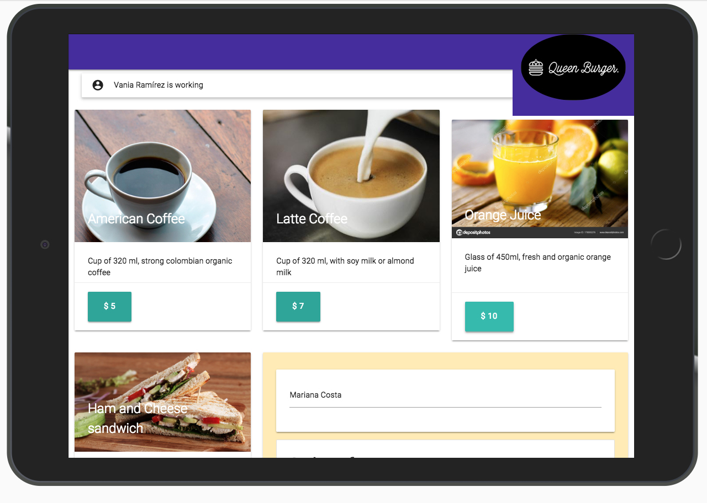

# Burger Queen

## Preámbulo

Este proyecto busca ser una solución a la recepción de pedidos en un restaurante de comida rápida, con internet intermitente y con un personal limitado.



Como punto de partida, se tiene la siguiente historia de usuario que nos comparten de un correo recibido del cliente:

> Somos **Burguer Queen**, una cadena de comida rápida 24hrs.
>
> Nuestra propuesta de servicio 24hrs ha tenido muy buena acogida, y para
> expandirnos necesitamos un sistema que nos ayude a tomar los pedidos de los
> clientes.
>
> Tenemos 2 menús: uno para el desayuno, que es muy sencillo:
>
> | Item                      | Precio |
> | ------------------------- | ------ |
> | Cafe americano            | 5      |
> | Cafe con leche            | 7      |
> | Sandwich de jamón y queso | 10     |
> | Jugo natural              | 7      |
>
> Y un menú para el resto del dia:
>
> <table width="100%">
>   <tbody>
>     <tr>
>       <td colspan="2" rowspan="1">Hamburguesas</td>
>       <td>Acompañamientos ($5)</td>
>       <td colspan="3" rowspan="1">Bebidas</td>
>     </tr>
>     <tr>
>       <td>Simple</td>
>       <td>10</td>
>       <td>Papas fritas</td>
>       <td></td>
>       <td>500ml</td>
>       <td>750ml</td>
>     </tr>
>     <tr>
>       <td>Doble</td>
>       <td>15</td>
>       <td>Onion Rings</td>
>       <td>Agua</td>
>       <td>5</td>
>       <td>8</td>
>     </tr>
>     <tr>
>       <td></td>
>       <td></td>
>       <td></td>
>       <td>refresco</td>
>       <td>7</td>
>       <td>10</td>
>     </tr>
>   </tbody>
> </table>
>
> Los clientes pueden escoger entre hamburguesas de res, de pollo, o vegetariana.
> **Y por \$1 pueden agregarle queso o huevo.**
>
> Nuestros clientes son bastante indecisos, por lo que es muy común que cambien el
> pedido varias veces antes de finalizarlo.

## Introducción

Partiendo de los requerimientos de negocio detallados en el correo del cliente,
nos piden construir **una interfaz que permita a lxs cajerxs tomar los pedidos
en una tablet, y desde ahí se puedan enviar a cocina** a través de un backend del
que nos darán detalles más adelante.

El primer paso de este proyecto debe ser convertir el menú descrito por el
cliente en una estructura que podamos poner en un archivo JSON para después
_pintar_ en la pantalla.

Nuestra interfaz debe mostrar los dos menús (desayuno y resto del día), cada uno
con todos sus _productos_. El usuario debe poder ir eligiendo que _productos_
agregar y la interfaz debe ir mostrando el _resumen del pedido_ con el total.

## Objetivos

El objetivo principal de aprendizaje de este proyecto es construir una
_interfaz web_ usando React para mantener la interfaz y el estado sincronizados, cada cambio sobre el estado se va a ir reflejando en la interfaz (por ejemplo, cada vez que agregamos un _producto_ a un _pedido_, la interfaz debe actualizar la lista del pedido y el total).

Como objetivo secundario, la implementación debe además seguir las
recomendaciones para PWAs (_Progressive Web Apps_), lo cual incluye conceptos
como **offline**.

Finalmente, la interfaz debe estar diseñada específicamente para correr en
**tablets**.

## Consideraciones generales para el desarrollo:

La lógica del proyecto está implementada completamente en JavaScript
(ES6+), HTML y CSS y empaquetada de manera automatizada.
Se ocupó la librería React JS.

La aplicación es un _Single Page App_. Los pedidos los tomaremos desde una
_tablet_, pero **no queremos una app nativa**, sino una web app que sea
**responsive** y pueda funcionar **offline**.

La aplicación desplegada debe tener 80% o más el las puntuaciones de
Performance, Progressive Web App, Accessibility y Best Practices de Lighthouse.

La aplicación debe hacer uso de `npm-scripts` y contar con scripts `start`,
`test`, `build` y `deploy`, que se encarguen de arrancar, correr las pruebas,
empaquetar y desplegar la aplicación respectivamente.

Los tests unitarios deben cubrir un mínimo del 70% de _statements_, _functions_,
_lines_ y _branches_.

Este proyecto incluye un _boilerplate_ con el código necesario para arrancar con
la parte de backend ya resuelta. El _boilerplate_ incluye los siguientes
archivos/carpetas con la configuración de Fierbase (hosting, firestore y
functions):

```text
./04-burger-queen/
├── firebase.json
├── firestore.indexes.json
├── firestore.rules
├── functions
│   ├── index.js
│   ├── package.json
└── README.md
```

### UI

#### Hito 1: Tomar pedidos

- Ingresar nombre del cliente.
- Filtrar _menú_ por _desayuno_ y _resto del día_.
- Agregar ítem al pedido.
- Eliminar ítem del pedido.
- Mostrar _resumen_ de pedido con todos los items y el total.
- Enviar a cocina (esto debe guardar el pedido).

#### Hito 2: Ver/atender pedidos

- Vista de pedidos pendientes
- Marcar pedido como listo
- Ver historial de pedidos

#### Hito 3: Autenticación

- Inicio de sesión
- Restaurar contraseña

### UX

- Debe **verse bien y funcionar bien en tablets**.
- **No queremos una app nativa**, sino una web app que se pueda _agregar a la
  pantalla de inicio_ como PWA.
- Queremos botones grandes para fácil uso en pantallas táctiles (touch screens).
- Queremos el estado actual del pedido siempre visible mientras tomamos un
  pedido.
- Queremos que sea accesible y que funcione bien en tablets iOS y Android.

## Hacker edition

Una vez que tengamos el sistema básico implementado, nos gustaría explorar
nuevas posibilidades, y estamos abiertos a cualquier sugerencia que tengan.
Algunas de las ideas que nos ha sugerido nuestros clientes son:

- agregar combos al menú
- cupones de descuento
- programa de fidelidad, etc.
- agregar _mesas_, de forma que los pedidos se puedan tomar en mesa en vez de
  dando el nombre del cliente al cajero.
- crear/editar/borrar usuarios
- ver estadísticas de pedidos

## Entregables

El proyecto será _entregado_ subiendo el código a GitHub (`commit`/`push`) y la
interfaz será desplegada usando GitHub pages u otro servicio de hosting.
|

# ToDo:

### General

- [ ] Producto final sigue los lineamientos del diseño.

### Lighthouse

- [ ] 80% o más en sección _Performance_.
- [ ] 80% o más en sección _Progressive Web App_.
- [ ] 80% o más en sección _Accessibility_.
- [ ] 80% o más en sección _Best Practices_.

### Tests

- [ ] 70% o más en cobertura de _statements_.
- [ ] 70% o más en cobertura de _functions_.
- [ ] 70% o más en cobertura de _lines_.
- [ ] 70% o más en cobertura de _branches_.

### UI

#### Hito 1: Tomar pedidos

- [ ] Ingresar nombre del cliente.
- [ ] Filtrar _menú_ por _desayuno_ y _resto del día_.
- [ ] Agregar ítem al pedido.
- [ ] Eliminar ítem del pedido.
- [ ] Mostrar _resumen_ de pedido con todos los items y el total.
- [ ] Enviar a cocina (esto debe guardar el pedido).

#### Hito 2: Ver/atender pedidos

- [ ] Vista de pedidos pendientes.
- [ ] Marcar pedido como listo.
- [ ] Ver historial de pedidos.

#### Hito 3: Autenticación

- [ ] Inicio de sesión.
- [ ] Restaurar contraseña.

### UX

- [ ] Se _ve_ bien y _funciona_ bien en tablets.
- [ ] Se puede _agregar a la pantalla de inicio_ como web app (tiene manifest,
      íconos, ...) en iOS y Android.
- [ ] Uso fácil en pantallas táctiles (touch screens).
- [ ] Estado actual del pedido siempre visible mientras tomamos un pedido.

### Herramientas empleadas:

**ReactJS**
**Firebase**
**Firestore DataBase**
**React-router**
**React-materialize**
